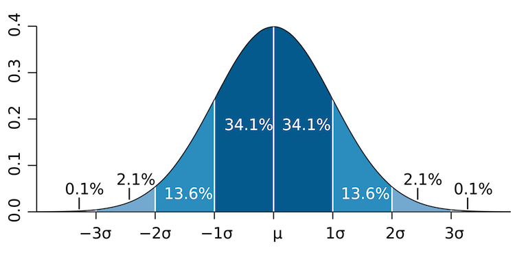
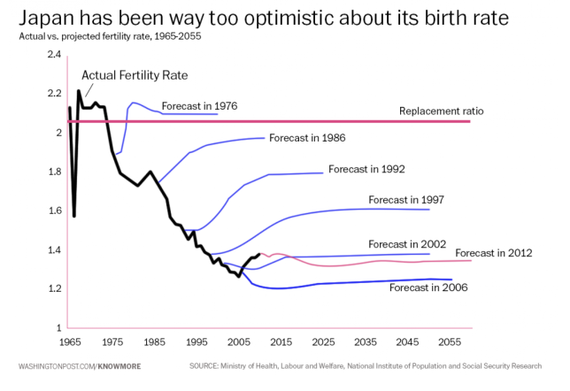

## Topics

1. Standard Deviation
2. Statistical Significance 
3. Linear Regression

--- &twocol

## Standard Deviation
A measure of dispersion of the data

*** =left 
``` {r, echo = 3 }
standard_deviation_10 <- rnorm(10000, mean = 0, sd = 10)
hist(standard_deviation_10, xlim = c(-250, 250), ylim = c(0, 2500))
```

*** =right
``` {r, echo = 3 }
standard_deviation_50 <- rnorm(10000, mean = 0, sd = 50)
hist(standard_deviation_50, xlim = c(-250, 250), ylim = c(0, 2500))
```

--- .class #id 
## Standard Deviation
If the data is distributed approximately normal then:

* 68% of data is within 1 standard deviation of the mean
* 95% of data is within 2 standard deviations of the mean
* 99% of data is within 3 standard deviations of the mean



--- .class #id 
## Standard Deviation
### Common Mistake

Not all data is normally distributed

``` {r, echo = 3 }
site_activity_after_email <- rlnorm(10000, meanlog = 0, sdlog = .9) 
hist(site_activity_after_email, xlim = c(0, 50) )
```


--- .class #id 
## Standard Deviation
### Use cases

* Filtering Outliers
  * For EE calcs we filter out any day where usage is greater than 4 standard deviations away from the mean

* Detecting Data Descrepencies
  * Data Ingestion -- usage, number of accounts

* Estimating Trends
  * Is this data likely due to a genuine change or is it explainable by noise

--- .class #id 
## Standard Deviation

Monthly Activations for program X
```
Mean: 212
Standard Deviation: 60 
```

* What should we think about a new month that has 
  * 177 activations?
  * 300 activations?
  * 13 activations?


--- .class #id 

``` {r, echo = 8}
library(ggplot2)
library(reshape2)
df <- data.frame(variable = c("a", "b", "c"), value = c(177, 300, 13))
plot <- ggplot(df, aes(x = variable, y = value)) + geom_bar(stat = 'identity', alpha = .7) + theme_bw() + theme(panel.border = element_rect(colour = 'white')) + labs(y = "Activations", x = "Scenario") 
plot + annotate("segment", x = 0, xend = 100, y = 212, yend = 212, colour = "blue", alpha = 0.7) + annotate("segment", x = 0, xend = 100, y = 152, yend = 152, colour = "green", alpha = 0.7) + annotate("segment", x = 0, xend = 100, y = 272, yend = 272, colour = "green", alpha = 0.7) + annotate("segment", x = 0, xend = 100, y = 92, yend = 92, colour = "red", alpha = 0.7) + annotate("segment", x = 0, xend = 100, y = 332, yend = 332, colour = "red", alpha = 0.7)
```

--- .class #id 
## Statistical Significance

```
Null Hypothesis: 
  Assumption that there is no relationship between variables of interest
```

1. False Positive: 
   - Type I Error 
   - the null hypothesis is true, but we reject it and believe something false
2. False Negative:
   - Type II Error 
   - the null hypothesis is false, but we fail to reject it and do not believe something true

--- .class #id 
## Statistical Significance

In a trial, the null hypothesis is that there is no relationship between the person and the crime:

  What type of error is it if an innocent person is convicted?

  What type of error is it if a guilty person is acquitted? 

--- .class #id 
## Statistical Significance 

* Beyond a reasonable doubt
   - makes false positive less likely
   - conversely, increases the likelihood of false negatives 

* a p-value allows us to control the probability of false positives 
   - by convention the threshold for statistical signficance is set to .05

```
"A p value is not a measure of how right you are, 
or how significant the difference is; 
it’s a measure of how surprised you should be 
if there is no actual difference between the groups, 
but you got data suggesting there is."
```
[statisticsdonewrong](http://www.statisticsdonewrong.com/data-analysis.html)

---  &twocol
## Statistical Significance 

*** =left

``` {r, echo = 7}
x <- data.frame(value=rnorm(1000, 2, 1),id = 1)
y <- data.frame(value=rnorm(1000,1,1), id =2)
data <- rbind(x, y)
library(ggplot2)
plot <- ggplot(data,aes(x=value, fill=factor(id))) + geom_density(alpha=0.25) + xlim(-5, 10) 
plot + theme_bw() + theme(panel.border = element_rect(colour = 'white'), legend.position = "none")  
```

*** =right

``` {r, echo = 7}
x <- data.frame(value=rnorm(1000, 4, 1),id = 1)
y <- data.frame(value=rnorm(1000,1,1), id =2)
data <- rbind(x, y)
library(ggplot2)
plot <- ggplot(data,aes(x=value, fill=factor(id))) + geom_density(alpha=0.25) + xlim(-5, 10) 
plot + theme_bw() + theme(panel.border = element_rect(colour = 'white'), legend.position = "none")  
```

--- .class #id 
## Statistical Significance 

### Common Mistake

Confusing statistical significance with practical signficance

A series of A/B tests reveal:  

```
Feature X will, on average, increase a user's pageviews by 3%.
```

```
Feature Y will, on average, decrease a user's energy usage by 3%.
```

Both results are highly statistically significant. (p value < .001) 

Which, if any, results should we care about?

--- .class #id 
## Statistical Significance 

### Common Mistake II

Interpreting results that are not statistically significant as if they still indicate 'something'

```
For program X, we showed energy savings of %0.8,
but the results were not statistically significant.
```

If results are not statistcally significant:
* they are indistinguishable from 0  
* no trend is indicated

It is ok to say that we don't know anything yet.

Yes, this is hard.
* Ask for the why

---  &twocol
## Linear Regression

*** =left

``` {r, echo = 4}
library(ggplot2)
plot <- ggplot(mtcars, aes( x = hp, y = mpg))
plot + geom_point() + theme_bw() + theme(panel.border = element_rect(colour = 'white')) + xlim(0, 400) + ylim(0, 400) 
```

*** =right

``` {r, echo = 4}
library(ggplot2)
plot <- ggplot(mtcars, aes( x = hp, y = mpg))
plot + geom_point() + theme_bw() + theme(panel.border = element_rect(colour = 'white')) + xlim(0, 400) + ylim(0, 40) 
```

--- &twocol
## Linear Regression

*** =left

``` {r, echo = 2}
plot + geom_point() + geom_smooth(method = lm, se = FALSE, fullrange = TRUE)  + theme_bw()  + theme(panel.border = element_rect(colour = 'white')) + xlim(0, 400) + ylim(0, 400) 
```

*** =right

``` {r, echo = 2}
plot + geom_point() + geom_smooth(method = lm, se = FALSE, fullrange = TRUE)  + theme_bw()  + theme(panel.border = element_rect(colour = 'white')) + xlim(0, 400) + ylim(0, 40) 
```

--- .class #id 

## Linear Regression
### Some junior high math

Equation for a line:
y = mx + b

m is the slope, b is the y-intercept

### Regression Equation
y = &beta;0 + &beta;1\*hp + _e_ 

&beta;0 is the y-intercept 
&beta;1 is the coefficient of hp 

### Interpreting the coefficient
A one unit change in hp will, on average, 
be associated with a &beta;1 change in mpg.

--- .class #id 

## Linear Regression
``` {r, echo = 2}
summary(lm( mpg ~ hp, mtcars))$coef
```

--- &twocol
## Linear Regression

*** =left

``` {r, echo = 2}
plot + geom_point() + geom_smooth(method = lm, se = TRUE, fullrange = TRUE, level = .95)  + theme_bw()  + theme(panel.border = element_rect(colour = 'white')) + xlim(0, 400) + ylim(0, 400) 
```

*** =right

``` {r, echo = 2}
plot + geom_point() + geom_smooth(method = lm, se = TRUE, fullrange = TRUE, level = .95)  + theme_bw()  + theme(panel.border = element_rect(colour = 'white')) + xlim(0, 400) + ylim(0, 40) 
```

--- .class #id 
## Prediction is hard



```
"It's hard to predict the future, especially when humans are involved."
```
[Flowing Data](http://flowingdata.com/2015/01/08/japan-fertility-rate-forecasts-versus-reality/)

--- &twocol 
## Possible Future Topics

*** =left
* Experimental Design
  * The power of randomized control trials
  * Sample Size
  * Selection Bias

* Predicitve Modeling
  * Regression vs Classification Problems
  * Supervised vs Unsupervised Learning
  * Evaluation
  * Training Data / Cross-Validation
  * Simulation as projection

*** =right
* A/B Testing
  * Importance of pre-defined criteria
  * Danger of repeated testing
  * Low Base Rate / Skewed Distribution (eg. conversions)

* Cognitive Biases
  * Framing Effects
  * Anchoring Effects
  * Prospect Theory
  * Paradox of Choice
  * Base Rate Fallacy

