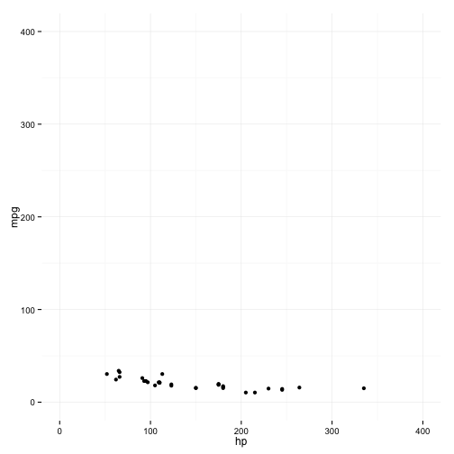
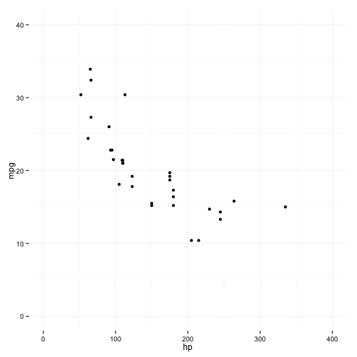
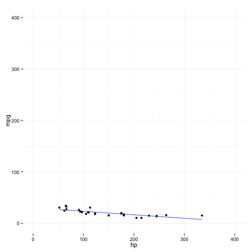
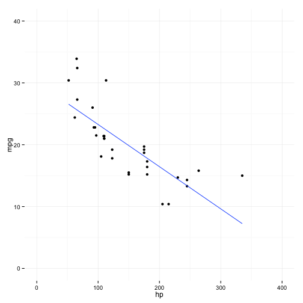

## Topics

1. Standard Deviation
2. Statistical Significance 
3. Linear Regression

--- &twocol

## Standard Deviation
A measure of dispersion of the data

*** =left 
 

*** =right
 

--- .class #id 
## Standard Deviation
If the data is distributed approximately normal then:

* 68% of data is within 1 standard deviation of the mean
* 95% of data is within 2 standard deviations of the mean
* 99% of data is within 3 standard deviations of the mean

--- .class #id 
## Standard Deviation
### Use cases

* Filtering Outliers
  * For EE calcs we filter out any day where usage is greater than 4 standard deviations away from the mean
* Detecting Data Descrepencies
  * Data Ingestion -- usage, number of accounts
* Thinking about the shape of data
  * High Standard Deviation indicates high fluxuations / volatilty 
  * Low Standard Deviation indicates consistently similar results

--- .class #id 
## Standard Deviation

Monthly Activations for program X
```
Mean: 212
Standard Deviation: 60 
```

* What should we think about a new month that has 
  * 177 activations?
  * 300 activations?
  * 13 activations?

--- &interactive
## Exploring SD


```r
require(googleVis)
```

```
## Loading required package: googleVis
```

```
## Warning in library(package, lib.loc = lib.loc, character.only = TRUE,
## logical.return = TRUE, : there is no package called 'googleVis'
```

```r
M1 <- gvisMotionChart(Fruits, idvar = 'Fruit', timevar = 'Year')
```

```
## Error in eval(expr, envir, enclos): could not find function "gvisMotionChart"
```

```r
print(M1, tag = 'chart')
```

```
## Error in print(M1, tag = "chart"): object 'M1' not found
```

--- .class #id 
## Statistical Significance

```
Null Hypothesis: 
  Assumption that there is no relationship between variables of interest
```

1. Type I Error: 
   - False Positive
   - the null hypothesis is true, but we reject it and believe something false
2. Type II Error: 
   - False Negative
   - the null hypothesis is false, but we fail to reject it and do not believe something true

What type of error is it if an innocent person is convicted?

What type of error is it if a guilty person is acquitted? 

--- .class #id 
## Statistical Significance 

* Beyond a reasonable doubt
   - makes Type I errors less likely
   - conversely, increases the likelihood of Type II errors

* a p-value allows us to control the probability of Type I errors
   - by convention the threshold for statistical signficance is set to .05

```
"A p value is not a measure of how right you are, 
or how significant the difference is; 
it’s a measure of how surprised you should be 
if there is no actual difference between the groups, 
but you got data suggesting there is."
```
[statisticsdonewrong](http://www.statisticsdonewrong.com/data-analysis.html)

--- .class #id 
## Statistical Significance 

### Common Mistake

Confusing statistical significance with practical signficance

A series of A/B tests reveal:  

```
Feature X will, on average, increase a user's time on the engagement platform by 3%.
```

```
Feature Y will, on average, increase a user's energy savings by 3%.
```

```
Feature Z will, on average, decrease a user's energy usage by 3%.
```

All results are highly statistically significant. (p value < .001) 

Which if any results should we care about?


---  &twocol
## Linear Regression

*** =left

 

*** =right

 

--- &twocol
## Linear Regression

*** =left

 

*** =right

 

--- .class #id 

## Linear Regression
### Some junior high math

Equation for a line:
y = mx + b

m is the slope, b is the y-intercept

### Regression Equation
y = &beta;0 + &beta;1\*X1 + _e_ 

&beta;0 is the y-intercept 
&beta;1 is the coefficient of X1

### Interpreting the coefficient
A one unit change in X1 will, on average, 
be associated with a &beta;1 change in Y.

--- .class #id 

## Linear Regression

```
## 
## Call:
## lm(formula = mpg ~ hp, data = mtcars)
## 
## Residuals:
##     Min      1Q  Median      3Q     Max 
## -5.7121 -2.1122 -0.8854  1.5819  8.2360 
## 
## Coefficients:
##             Estimate Std. Error t value Pr(>|t|)    
## (Intercept) 30.09886    1.63392  18.421  < 2e-16 ***
## hp          -0.06823    0.01012  -6.742 1.79e-07 ***
## ---
## Signif. codes:  0 '***' 0.001 '**' 0.01 '*' 0.05 '.' 0.1 ' ' 1
## 
## Residual standard error: 3.863 on 30 degrees of freedom
## Multiple R-squared:  0.6024,	Adjusted R-squared:  0.5892 
## F-statistic: 45.46 on 1 and 30 DF,  p-value: 1.788e-07
```

--- .class #id 

## Linear Regression
### Recap
* A coefficient measures the on average association of the independent variable with the dependent variable.
* The p-value measures how surpised we should be to get this data if there was no association between the independent variable and the dependent variable.
* Using a threshold of .05 for statistical significance means we are ok with committing a type I error on average 1 in 20 times. 

--- .class #id 

## Linear Regression
### Applied to EE calcs 

* (simplified EE regression equation)
  * KWH = &beta;0 +  &beta;1\*treatment + e 
* Being in the treatment group is a dummy variable (0 or 1) 
* The coefficient of that variable is the impact of our program on energy usage 

### A percentage interpretation
  * Log transforming the dependent variable allows:

A one unit change in X1 will, on average, 
be associating with a &beta;1 * 100 percent 
change in Y.

--- &twocol 
## Possible Future Topics

*** =left
* Experimental Design
  * The power of randomized control trials
  * Sample Size
  * Selection Bias

* Predicitve Modeling
  * Regression vs Classification Problems
  * Supervised vs Unsupervised Learning
  * Evaluation
  * Training Data / Cross-Validation
  * Simulation as projection

*** =right
* A/B Testing
  * Importance of pre-defined criteria
  * No Peaking
  * Danger of repeated testing
  * Low Base Rate / Skewed Distribution (eg. conversions)

* Cognitive Biases
  * Framing Effects
  * Anchoring Effects
  * Prospect Theory
  * Paradox of Choice
  * Base Rate Fallacy

